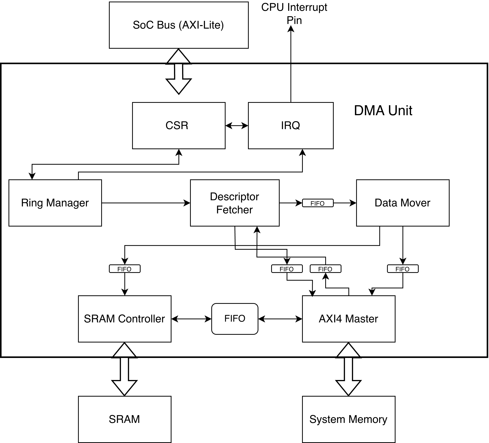

# Scatter–Gather AXI DMA Engine (Descriptor-Ring Based)

A memory-mapped DMA subsystem that moves data between **system memory** (AXI4 full) and **on-chip SRAM** using a **descriptor ring** in system memory. The CPU programs ring placement and control through **AXI4-Lite CSRs**; the engine fetches each descriptor over AXI, issues paired moves on the SRAM and system-memory sides, updates **`HEAD` in CSRs**, and signals the CPU with a **level interrupt** when work completes or errors.

Detailed behavior is in [`docs/`](docs/).

## Overview

| Plane | Role |
|--------|------|
| **CPU (control)** | Programs `BASEADDR`, `RINGLEN`, `HEAD`/`TAIL`, `CTRL` (enable/reset/IRQ enables); reads `STATUS` / `IRQ_STATUS`; clears interrupts via `IRQ_CLEAR`. |
| **DMA (data + schedule)** | Ring Manager schedules descriptor addresses; Descriptor Fetcher pulls descriptor contents via the AXI4 Master; Data Mover turns each descriptor into **two instruction streams** (SRAM + system memory); AXI4 Master and SRAM Controller execute those instructions. |

The CPU posts descriptors into the ring and advances `TAIL`; the hardware consumes from `HEAD` and advances `HEAD` after each descriptor completes (success or error). High throughput comes from streaming through the ring with minimal CPU involvement.

## Architecture

The diagram matches the main internal blocks:

- **CSR** — AXI4-Lite slave: ring base/length, `HEAD`/`TAIL`, control, sticky `STATUS`, `IRQ_STATUS`, write-1-to-clear `IRQ_CLEAR` (see [`docs/csr_spec.md`](docs/csr_spec.md)).
- **Ring Manager** — Computes `DESC_ADDR = BASEADDR + HEAD * DESC_SIZE`, issues descriptor fetches when `CTRL.ENABLE` is set and work is available; updates `HEAD`; notifies **IRQ** on empty and error ([`docs/ring_manager_spec.md`](docs/ring_manager_spec.md)).
- **Descriptor Fetcher** — No deep ring-side FIFO: the Ring Manager controls when a descriptor is valid. It sends a **handle** to the AXI4 Master to read the descriptor from system memory, receives the **descriptor struct** on a callback FIFO, and forwards the descriptor to the Data Mover on the **DF–DM FIFO** ([`docs/descriptor_fetcher_spec.md`](docs/descriptor_fetcher_spec.md), [`docs/handle_struct.md`](docs/handle_struct.md)).
- **AXI4 Master** — Serves **handle**-driven descriptor reads and **instruction**-driven payload reads/writes. If a handle and a data-mover instruction collide, **handle wins** ([`docs/axi4master_spec.md`](docs/axi4master_spec.md)).
- **Data Mover** — Consumes one **descriptor** per job and decodes it into **two instruction structs** (SRAM path + system-memory path) according to descriptor `FLAGS.DIR` ([`docs/data_mover_spec.md`](docs/data_mover_spec.md), [`docs/descriptor_struct.md`](docs/descriptor_struct.md), [`docs/instruction_struct.md`](docs/instruction_struct.md)). Payload return data from system memory is coordinated through the Data Mover path (FIFOs in the diagram) rather than wired directly SRAM↔AXI in isolation.
- **SRAM Controller** — Local memory interface driven by the Data Mover instruction stream.
- **IRQ** — Does not move data. Latches events from the Ring Manager/datapath into CSR bits; drives a **level** `irq_o` gated by interrupt enables; software clears via `IRQ_CLEAR` so the interrupt can deassert ([`docs/irq_spec.md`](docs/irq_spec.md)).

## Typical software flow

1. **Lay out the ring in system memory** — Array of descriptors (`SRC_ADDR`, `DST_ADDR`, `LEN`, `FLAGS`; four 32-bit words per entry).
2. **Program CSRs** — `BASEADDR`, `RINGLEN`, set `TAIL` (and initial `HEAD` policy per your integration), assert `CTRL.ENABLE`, configure interrupt enables as needed.
3. **Enqueue work** — Write descriptor(s) at `BASEADDR + index * DESC_SIZE`, then advance `TAIL` (without overrunning the ring; see [`docs/csr_spec.md`](docs/csr_spec.md)).
4. **Hardware runs** — Ring Manager → Descriptor Fetcher (handle + AXI read) → Data Mover → parallel SRAM + AXI payload activity → `HEAD` advances; on ring empty or error, relevant `STATUS` / `IRQ_STATUS` bits latch.
5. **ISR** — Read `STATUS` / `IRQ_STATUS`, handle completion or error; write `IRQ_CLEAR` to clear sticky sources and drop `irq_o`.

## Documentation index

| Document | Topic |
|----------|--------|
| [`docs/csr_spec.md`](docs/csr_spec.md) | Register map, ring semantics |
| [`docs/ring_manager_spec.md`](docs/ring_manager_spec.md) | Scheduling, `HEAD`, empty/error signaling |
| [`docs/descriptor_fetcher_spec.md`](docs/descriptor_fetcher_spec.md) | DF interfaces and flow |
| [`docs/data_mover_spec.md`](docs/data_mover_spec.md) | Descriptor → dual instruction streams |
| [`docs/axi4master_spec.md`](docs/axi4master_spec.md) | Handles vs payload arbitration |
| [`docs/irq_spec.md`](docs/irq_spec.md) | IRQ/status behavior |
| [`docs/descriptor_struct.md`](docs/descriptor_struct.md) | Descriptor memory layout |
| [`docs/handle_struct.md`](docs/handle_struct.md) | Descriptor-fetch handle |
| [`docs/instruction_struct.md`](docs/instruction_struct.md) | Payload instruction fields |

# Contributors
Xuyi Zhou, Benjamin Wong-Fodor, Aarya Patel, You-wei (Terry) Lu
